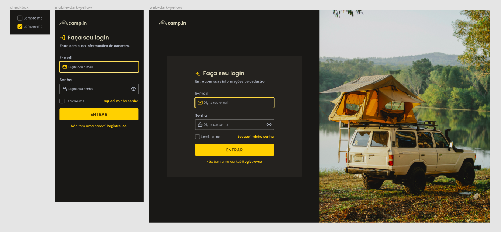

<h1 align="center"> Login Form </h1>

## Descrição

A página representa uma página onde o usuário poderá fazer realizar seu login. Foi desenvolvido a partir do conhecimento obtido no programa Discover, disponível gratuitamente no site da [Rocketseat](https://www.rocketseat.com.br/).

## Tecnologias

O projeto foi desenvolvido com as seguintes tecnologias:

- HTML
- CSS

## Recursos adicionais 

A fim de tornar o projeto mais acessível, o mesmo foi realizado com responsividade para todos os tamanhos de tela.

## Layout

 

  

Você pode visualizar o layout do projeto original clicando [aqui](<https://www.figma.com/file/SySOtDgZpnytV2DWtpqdiw/DD-%2F-Login-Form---CSS-(Copy)?node-id=216%3A2>).

<h4 align="center"> 
	🚧  em construção  🚧  
	ao finalizar os estudos sobre as próximas linguagens, o website será totalmente funcional.
</h4>